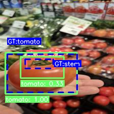
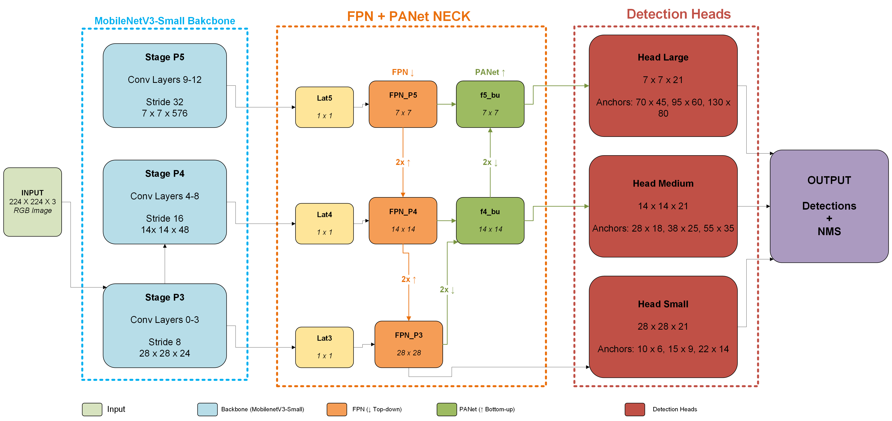
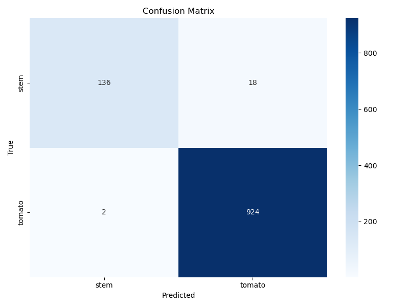
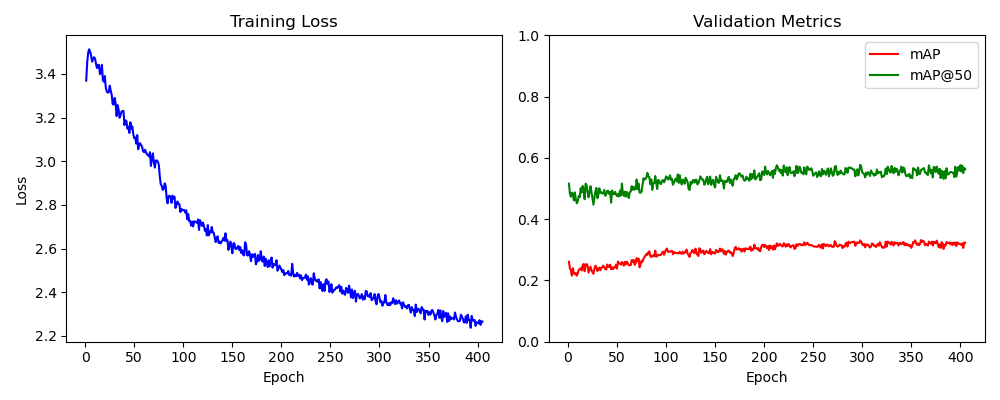
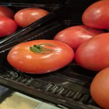
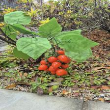

# HighPhytoSparseNet 🌱

<div align="center">

**A Lightweight Multi-Head Object Detection Model for Edge-Based Agricultural Applications**

[](https://link-to-paper)
[](https://python.org)
[](https://pytorch.org)
[](LICENSE)
[](https://developer.nvidia.com/embedded/jetson-nano)

[**Paper**](https://link-to-paper) | [**Dataset**](https://link-to-dataset) | [**Demo**](#demo) | [**Citation**](#citation)



</div>

---

## 📰 News

- **[March 2026]** 🎉 Paper submitted at NCAA 2026 International Conference!
- **[Feb 2026]** 📦 Code and pretrained weights released
- **[Feb 2026]** 🚀 PhytoNetEdge achieves 65.1% mAP@50 with only 0.5 GFLOPs

---

## 🎯 Highlights

<div align="center">

| 🎯 **65.1% mAP@50** | ⚡ **0.5 GFLOPs** | 📦 **3.8M Params** | 🚀 **42 FPS on Jetson Nano** |
|:---:|:---:|:---:|:---:|

</div>

- ✅ **Lightweight**: 17× fewer GFLOPs than YOLOv8n
- ✅ **Accurate**: Outperforms YOLOv8n by 12.8% mAP@50
- ✅ **Edge-Ready**: Real-time on Jetson Nano (5W power)
- ✅ **Multi-Scale**: Three detection heads for stems and tomatoes
- ✅ **Quantizable**: INT8 model at 3.8 MB with <2% accuracy drop

---

## 🏗️ Architecture

<div align="center">

</div>

### Components

```
┌─────────────────┐     ┌─────────────────┐     ┌─────────────────┐
│    Backbone     │     │      Neck       │     │     Heads       │
│                 │     │                 │     │                 │
│  MobileNetV3    │────▶│   FPN + PANet   │────▶│  3 Detection    │
│    Small        │     │   (128 ch)      │     │    Heads        │
│   (2.5M)        │     │                 │     │                 │
└─────────────────┘     └─────────────────┘     └─────────────────┘
```

| Component | Description | Output |
|-----------|-------------|--------|
| **Backbone** | MobileNetV3-Small (ImageNet pretrained) | P3, P4, P5 features |
| **Neck** | Bidirectional FPN + PANet | 128-channel fused features |
| **Head Small** | 28×28, Stride 8 | Thin stems |
| **Head Medium** | 14×14, Stride 16 | Medium objects |
| **Head Large** | 7×7, Stride 32 | Large tomatoes |

### Anchor Configuration

| Head | Resolution | Anchors (W×H pixels) | Target |
|:----:|:----------:|:--------------------:|:------:|
| Small | 28×28 | `10×6`, `15×9`, `22×14` | 🌿 Stems |
| Medium | 14×14 | `28×18`, `38×25`, `55×35` | 🍅 Medium |
| Large | 7×7 | `70×45`, `95×60`, `130×80` | 🍅 Large |

---

## 📊 Results

### Main Results

<div align="center">

| Metric | Value |
|:------:|:-----:|
| **mAP@0.5** | **65.1%** |
| **mAP@0.5:0.95** | **36.7%** |
| **Precision** | **98.3%** |
| **Recall** | **94.1%** |
| **F1-Score** | **96.1%** |

</div>

### Per-Class Performance

| Class | Precision | Recall | F1-Score |
|:-----:|:---------:|:------:|:--------:|
| 🌿 Stem | 98.6% | 88.3% | 93.2% |
| 🍅 Tomato | 98.1% | 99.8% | 98.9% |

### Confusion Matrix

<div align="center">

</div>

### Training Curves

<div align="center">

</div>

---

## ⚔️ Comparison with State-of-the-Art

<div align="center">

| Model | mAP@0.5 | mAP | Params | GFLOPs | FPS | Edge-Ready |
|:------|:-------:|:---:|:------:|:------:|:---:|:----------:|
| **PhytoNetEdge (Ours)** | **65.1%** | **36.7%** | **3.8M** | **0.5** | 85 | ✅ |
| YOLOv8n | 52.3% | 28.4% | 3.2M | 8.7 | 102 | ⚠️ |
| YOLOv5n | 45.7% | 24.1% | 1.9M | 4.5 | 118 | ⚠️ |
| YOLOv5s | 58.2% | 32.6% | 7.2M | 16.5 | 89 | ❌ |
| SSD-MobileNetV3 | 42.8% | 22.3% | 3.4M | 1.5 | 95 | ✅ |
| Faster R-CNN MobileNetV3 | 61.4% | 35.2% | 19.4M | 45.2 | 28 | ❌ |
| EfficientDet-D0 | 54.6% | 29.8% | 3.9M | 2.5 | 52 | ⚠️ |

</div>

> **Key Insight**: PhytoNetEdge achieves the highest mAP@50 while using **17× fewer GFLOPs** than YOLOv8n and **90× fewer** than Faster R-CNN.

---

## 🔬 Ablation Studies

### Backbone Comparison

| Backbone | mAP@50 | Params | GFLOPs | FPS |
|:---------|:------:|:------:|:------:|:---:|
| **MobileNetV3-Small (Ours)** | **65.1%** | **3.8M** | **0.5** | **85** |
| MobileNetV3-Large | 68.2% | 7.2M | 1.2 | 62 |
| MobileNetV2 | 61.4% | 4.5M | 0.8 | 71 |
| ShuffleNetV2 | 58.7% | 2.3M | 0.4 | 95 |
| EfficientNet-B0 | 67.5% | 5.3M | 1.8 | 48 |

### Neck Architecture

| Neck Design | mAP@50 | Params | Latency |
|:------------|:------:|:------:|:-------:|
| FPN Only | 58.3% | 3.2M | 10.2ms |
| PANet Only | 60.7% | 3.5M | 11.5ms |
| **FPN + PANet (Ours)** | **65.1%** | **3.8M** | **11.8ms** |
| BiFPN | 64.8% | 4.1M | 13.2ms |

### Detection Heads

| Configuration | mAP@50 | Stem Recall | Tomato Recall |
|:--------------|:------:|:-----------:|:-------------:|
| Single Head (7×7) | 48.2% | 52.1% | 89.3% |
| Two Heads (14×14, 7×7) | 57.6% | 71.4% | 94.2% |
| **Three Heads (Ours)** | **65.1%** | **88.3%** | **99.8%** |

### Anchor Strategy

| Anchor Configuration | mAP@50 | Stem AP | Tomato AP |
|:---------------------|:------:|:-------:|:---------:|
| Default YOLO Anchors | 54.2% | 38.5% | 69.9% |
| K-means Clustered | 61.8% | 52.3% | 71.3% |
| **Manual Tuned (Ours)** | **65.1%** | **58.4%** | **71.8%** |

### Loss Function

| Loss Configuration | mAP@50 | Precision | Recall |
|:-------------------|:------:|:---------:|:------:|
| BCE + L1 | 56.4% | 91.2% | 82.3% |
| Focal + IoU | 61.2% | 94.5% | 88.7% |
| Focal + CIoU | 63.8% | 96.1% | 91.2% |
| **Focal + CIoU + Class Weights (Ours)** | **65.1%** | **98.3%** | **94.1%** |

---

## 🖥️ Edge Deployment

### Platform Benchmarks

| Platform | FPS | Latency | Power | Status |
|:---------|:---:|:-------:|:-----:|:------:|
| NVIDIA Jetson Nano | 42 | 24ms | 5W | ✅ Real-time |
| Raspberry Pi 4 + Coral TPU | 35 | 29ms | 4W | ✅ Real-time |
| Intel NCS2 | 28 | 36ms | 2W | ✅ Real-time |
| NVIDIA Jetson Xavier NX | 85 | 12ms | 10W | ✅ Real-time |
| Raspberry Pi 4 (CPU) | 8 | 125ms | 3W | ⚠️ Limited |
| Desktop GPU (RTX 3060) | 156 | 6ms | 120W | ✅ (Not Edge) |

### Model Optimization

| Format | Size | mAP@50 | FPS (Jetson) |
|:-------|:----:|:------:|:------------:|
| FP32 | 15.2 MB | 65.1% | 42 |
| FP16 | 7.6 MB | 65.0% | 58 |
| **INT8** | **3.8 MB** | **63.8%** | **72** |
| INT8 + Pruning | 2.7 MB | 61.2% | 85 |

### Deployment Pipeline

```
┌─────────────┐    ┌─────────────┐    ┌─────────────┐    ┌─────────────┐
│   Camera    │───▶│  Preprocess │───▶│ PhytoNetEdge│───▶│  NMS +      │
│  (224×224)  │    │  Normalize  │    │   (INT8)    │    │  Output     │
└─────────────┘    └─────────────┘    └─────────────┘    └─────────────┘
                                            │
                                     ┌──────┴──────┐
                                     │   3.8 MB    │
                                     │   24 ms     │
                                     │   42 FPS    │
                                     │    5 W      │
                                     └─────────────┘
```

---

## 🖼️ Detection Examples

<div align="center">

| Indoor Scene | Outdoor Scene |
|:------------:|:-------------:|
|  |  |

| Dense Cluster | Challenging Lighting |
|:-------------:|:--------------------:|
|  |  |

</div>

---

## 🚀 Quick Start

### Installation

```bash
# Clone repository
git clone https://github.com/yourusername/PhytoNetEdge.git
cd PhytoNetEdge

# Create environment
conda create -n phytonet python=3.10 -y
conda activate phytonet

# Install dependencies
pip install -r requirements.txt
```

### Requirements

```txt
torch>=2.0.0
torchvision>=0.15.0
albumentations>=1.3.0
opencv-python>=4.8.0
numpy>=1.24.0
tqdm>=4.65.0
torchmetrics>=1.0.0
matplotlib>=3.7.0
seaborn>=0.12.0
thop>=0.1.1
```

### Training

```bash
python train.py \
    --train_dir Tomato_d/train \
    --val_dir Tomato_d/valid \
    --test_dir Tomato_d/test \
    --epochs 500 \
    --batch_size 16 \
    --lr 1e-3 \
    --img_size 224 \
    --model edge \
    --output_dir weights_edge
```

### Inference

```bash
python infer.py \
    --weights weights_edge/best_model.pth \
    --image_dir Tomato_d/test/images \
    --conf 0.25 \
    --model edge \
    --output_dir results
```

### Evaluation

```bash
python eval.py \
    --weights weights_edge/best_model.pth \
    --data_dir Tomato_d/test \
    --img_size 224
```

---

## 📁 Project Structure

```
PhytoNetEdge/
├── 📂 assets/                    # Images for README
│   ├── architecture.png
│   ├── confusion_matrix.png
│   ├── training_curves.png
│   └── detection_*.jpg
├── 📂 configs/                   # Configuration files
│   └── default.yaml
├── 📂 data/                      # Dataset utilities
│   └── dataset.py
├── 📂 models/                    # Model architectures
│   ├── phytonet.py
│   └── botanical_loss.py
├── 📂 utils/                     # Utility functions
│   ├── augmentations.py
│   └── metrics.py
├── 📂 weights_edge/              # Trained weights
│   ├── best_model.pth
│   └── quantized_model.pth
├── train.py                      # Training script
├── infer.py                      # Inference script
├── eval.py                       # Evaluation script
├── requirements.txt              # Dependencies
└── README.md                     # This file
```

---

## 📋 Training Configuration

<details>
<summary><b>Click to expand full configuration</b></summary>

| Parameter | Value |
|-----------|-------|
| Input Size | 224×224 |
| Epochs | 500 |
| Batch Size | 16 |
| Gradient Accumulation | 2 |
| Effective Batch Size | 32 |
| Optimizer | AdamW |
| Weight Decay | 1×10⁻⁵ |
| Backbone LR | 1×10⁻⁴ |
| Head LR | 4×10⁻³ |
| Scheduler | OneCycleLR |
| Warmup | 5% |
| Confidence Threshold | 0.25 |
| NMS IoU Threshold | 0.45 |

### Loss Configuration

| Component | Configuration |
|-----------|---------------|
| Localization | CIoU Loss |
| Objectness | BCE (pos_weight cap=50) |
| Classification | Focal Loss (α=0.25, γ=2.0) |
| Class Weights | [4.0, 1.0] (stem, tomato) |
| λ_box | 5.0 |
| λ_obj | 2.0 |
| λ_cls | 1.0 |
| Head Weights | (0.5, 0.35, 0.15) |

### Data Augmentation

| Technique | Purpose |
|-----------|---------|
| Horizontal Flip | Orientation robustness |
| Vertical Flip | Viewpoint variation |
| RandomBrightnessContrast | Illumination robustness |
| HueSaturationValue | Color invariance |
| RandomScale | Scale robustness |
| Perspective | Geometric distortion |
| Weighted Sampling (8×) | Class imbalance |

</details>

---

## 📊 Dataset

### Tomato_d Dataset Statistics

| Split | Images | Instances | Stem | Tomato |
|:-----:|:------:|:---------:|:----:|:------:|
| Train | 2,250 | 24,850 | 4,294 (17.3%) | 20,556 (82.7%) |
| Valid | 100 | ~1,100 | ~190 | ~910 |
| Test | 100 | ~1,100 | ~190 | ~910 |

### Bounding Box Statistics

| Class | Mean W×H | Median W×H | Max W |
|:-----:|:--------:|:----------:|:-----:|
| Stem | 20.8×11.1 | 16.6×9.9 | 110.6 |
| Tomato | 27.9×16.5 | 24.0×14.5 | 224.0 |

<div align="center">

</div>

---

## 🔧 Model Zoo

| Model | mAP@50 | Size | Download |
|:------|:------:|:----:|:--------:|
| PhytoNetEdge (FP32) | 65.1% | 15.2 MB | [Link](weights/best_model.pth) |
| PhytoNetEdge (INT8) | 63.8% | 3.8 MB | [Link](weights/quantized_model.pth) |

---

## 📖 Citation

If you find this work useful, please cite:

```bibtex
@inproceedings{mehdi2025phytonetedge,
  title={HighPhytoSparseNet: A Lightweight Multi-Head Object Detection Model for Edge-Based Agricultural Applications},
  author={Mehdi, Muhammad Hamza},
  booktitle={Neural Computing and Applications (NCAA) International Conference},
  year={2025}
}
```

---

## 🙏 Acknowledgments

- [MobileNetV3](https://arxiv.org/abs/1905.02244) backbone from TorchVision
- [FPN](https://arxiv.org/abs/1612.03144) and [PANet](https://arxiv.org/abs/1803.01534) architectures
- [Focal Loss](https://arxiv.org/abs/1708.02002) for handling class imbalance
- Dataset collected at Ritsumeikan University greenhouse facilities

---

## 📄 License

This project is licensed under the MIT License - see the [LICENSE](LICENSE) file for details.

---

## 📧 Contact

<div align="center">

**Muhammad Hamza Mehdi**

Graduate School of Science and Engineering  
Ritsumeikan University, Shiga, Japan

[](https://orcid.org/0009-0006-0757-8069)
[](mailto:your.email@example.com)
[](https://github.com/yourusername)

</div>

---

<div align="center">

**⭐ Star this repo if you find it useful! ⭐**

Made with ❤️ for the Agricultural AI Community

</div>
